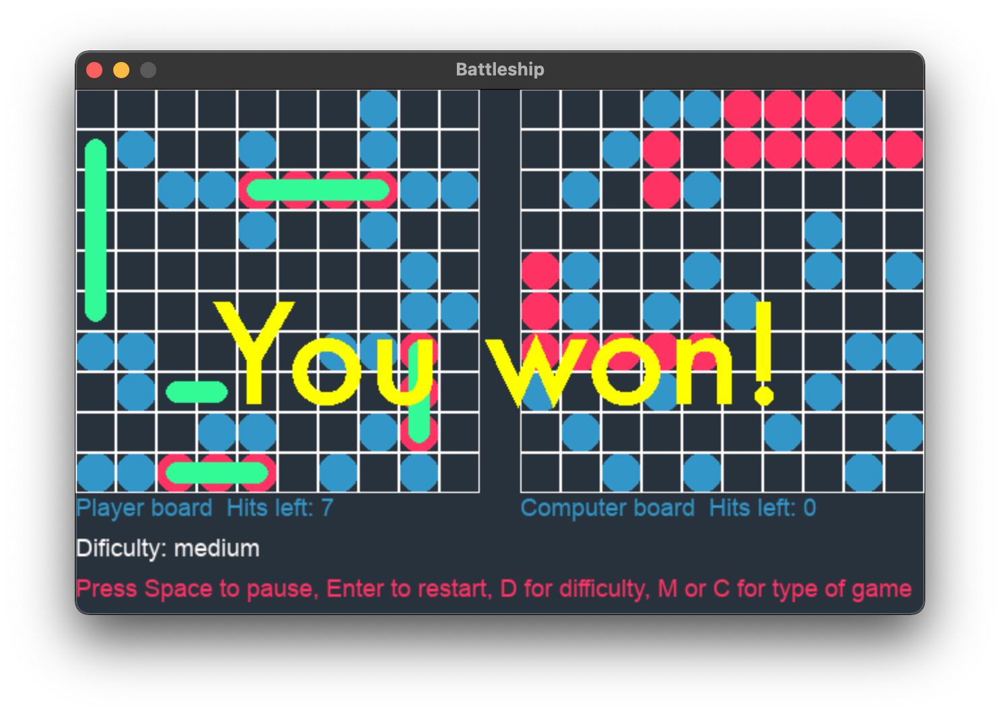
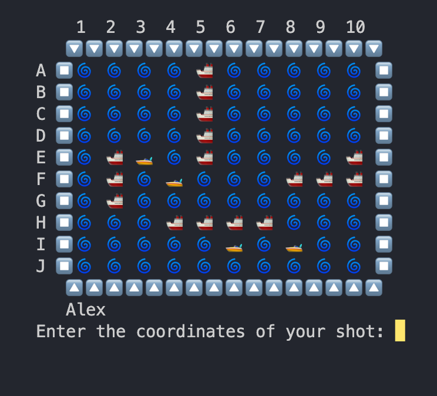

# Battleship

Just another take on the classic Battleship game.

- [Battleship](#battleship)
  - [How to run it](#how-to-run-it)
  - [How to play](#how-to-play)
  - [GUI - How to play](#gui---how-to-play)
  - [AI - How it works](#ai---how-it-works)
  - [Database](#database)
  - [How it looks](#how-it-looks)
    - [GUI Mode](#gui-mode)
    - [Win in GUI](#win-in-gui)
    - [Lost in GUI](#lost-in-gui)
    - [Terminal play](#terminal-play)
    - [Board in terminal - Style 1](#board-in-terminal---style-1)
    - [Board in terminal - Style 2](#board-in-terminal---style-2)

---

## How to run it

Run the game by typing `python3 battleship.py` in the terminal. You can also run the game with a GUI by typing `python3 gui_pygame.py`.

---

## How to play

The program will start by entering the main menu. The Developer option is for testing different functions, like importing information into the database or updating user information or removing information.
The game is classic, no explanations required. The ships are placed randomly horizontally or vertically. The ships placement follows the rules by not overlaping or crossing the border. The game will end when all of the ships have been sunk.

---

## GUI - How to play

Run the game by typing `python3 gui_pygame.py` in the terminal. The game is using pygame to create the GUI. The screen is split in 3 areas, left for user board, right for the computer board and the bottom for the messages. There is a option to play this game with (4, 3, 3, 2, 2, 2, 1, 1, 1, 1) placement or the classic (5, 4, 3, 3, 2) placement by pressing M or C. The user can reset the game by pressing Enter and get a new random board. The game can be paused by pressing the space bar. For returning to the main menu press the escape key or close the window.
The dificulty can be changed by pressing D witch will change the AI dificulty.

---

## AI - How it works

The AI has 3 settings, easy, medium, and hard.
The easy setting is a random shot generator. The medium setting it will shot randomly but as a plus if a ship is found will check the other cells around it and shoot there. It can find the direction of the ship also. The hard settings is the same as the medium but it will use a checkerboard pattern to find the ships, it uses half the bord to shoot.
There is no other algorithm used, just random and checkerboard pattern.

---

## Database

The database is stored in data/users.db and is a sqlite database. It has 2 tables, users and positions. The users table accept info about users, the password is encrypted before and stored encrypted. This table is used for the Highscore in the menu. Table positions stores the randomly generated positions of 1000 games. The info comes from ships.txt file, also autogenerated using a function, creating an object of the class player for a thousand times and storing the ship positions. Every row in the database stores all positions for a (5, 4, 3, 3 ,2) placement.

---

## How it looks

### GUI Mode

 

### Win in GUI

### Lost in GUI

### Terminal play

### Board in terminal - Style 1

### Board in terminal - Style 2

---

Back to [Python Projects](/README.md)
