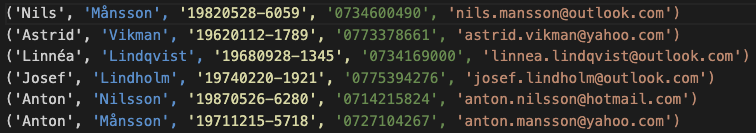

# Random Person Data Generator

This is a simple random person data generator. It generates random data for a person, including name, address, phone number, email, etc. It can be used to generate test data for a database, or to populate a web form with random data.

The information generated is not real, it is just random data. It is not meant to be used for any other purpose than testing. The perssonnumer is not a valid Swedish personnummer, it is just a random number. In case you are wondering, the personnummer is a Swedish personal identification number.

I needed to populate a database with random data for testing. So I created this script to generate random data. Then later I used again when I needed to create random users for Active Directory on a Windows Server. A bit of automation goes a long way specially when you must create 200+ users. It can be modified to export the data to a CSV file, JSON file or even a database. I have included a sample CSV file as well.

I also used this to generate large amounts of random data, and then do some simple data analysis on the data, for example: How many people have a certain last name, or how many people have a certain first name, or the age distribution of the people, location distribution, etc.

Used [Chart.js](https://www.chartjs.org/) or [Matplotlib](https://matplotlib.org/) to create some simple charts

---

## How it looks

CSV file with random data.

---

Terminal output.

---

## Usage

Just run the script.
>How?
>>You will figure it out 😀

No special requirements! Last time I checked, it works with Python 3.11

It imports the following modules: datetime, random, string, json which are part of the standard library.

---

## License

Yeah, no license for this one.

&copy; 2023 [Alex Roman](https://github.com/AlexRoman777). ~~All rights reserved~~. Just kidding...

---

Back to [Python Projects](/README.md)
