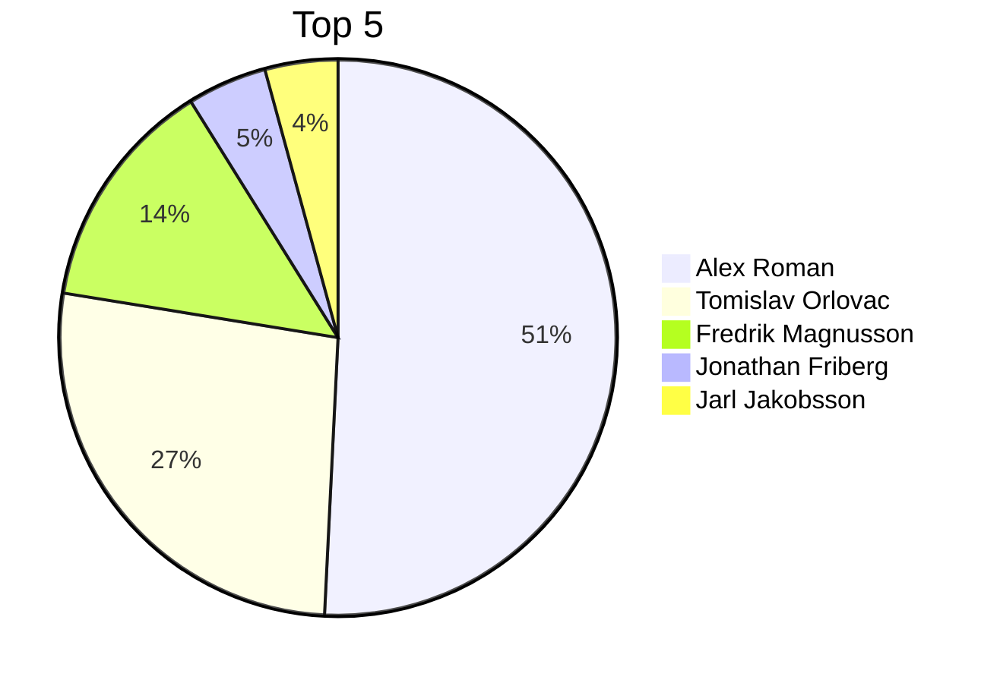

# DevOps 22 - GitHub contributions

---

| Place | User | Contributions | ^ |
| --- | --- | :---: | :---: |
| 1 | Alex Roman | 2589 | 9 |
| 2 | Tomislav Orlovac | 1366 | 0 |
| 3 | Fredrik Magnusson | 692 | 0 |
| 4 | Jonathan Friberg | 236 | 0 |
| 5 | Jarl Jakobsson | 216 | 0 |
| 6 | Alexander Lundgren | 187 | 0 |
| 7 | Gustav Öberg | 127 | 0 |
| 8 | Mario Khalaf | 113 | 0 |
| 9 | David Hasenson | 98 | 0 |
| 10 | Rickard Lindqvist | 93 | 0 |
| 11 | Fabian Lörstad | 78 | 0 |
| 12 | Karl Björklund  | 61 | 0 |
| 13 | Timmy Elf | 61 | 0 |
| 14 | David Sundgren | 49 | 0 |
| 15 | Mira Lee | 45 | 0 |
| 16 | Isabel Valijani | 36 | 0 |
| 17 | Anton Ottonson | 31 | 0 |
| 18 | Oskar Tölli | 28 | 0 |
| 19 | Daniel Bruno Matzui | 27 | 0 |
| 20 | Hugo Göransson | 25 | 0 |
| 21 | Dennis Lunnelid | 22 | 0 |
| 22 | Pavel Kostyuk | 20 | 0 |
| 23 | Isac Grive | 16 | 0 |
| 24 | Charalampos Moutsios | 16 | 0 |
| 25 | Mandana Jahangosha | 14 | 0 |
| 26 | Martin Alfredson | 13 | 0 |
| 27 | Julian Bellotto | 13 | 0 |
| 28 | Saman Petfat | 10 | 0 |
| 29 | Frida Lundström | 10 | 0 |
| 30 | Odd Jensen | 9 | 0 |
| 31 | Raffi Avakian | 8 | 0 |

---

## Top 5 - Pie chart

---

