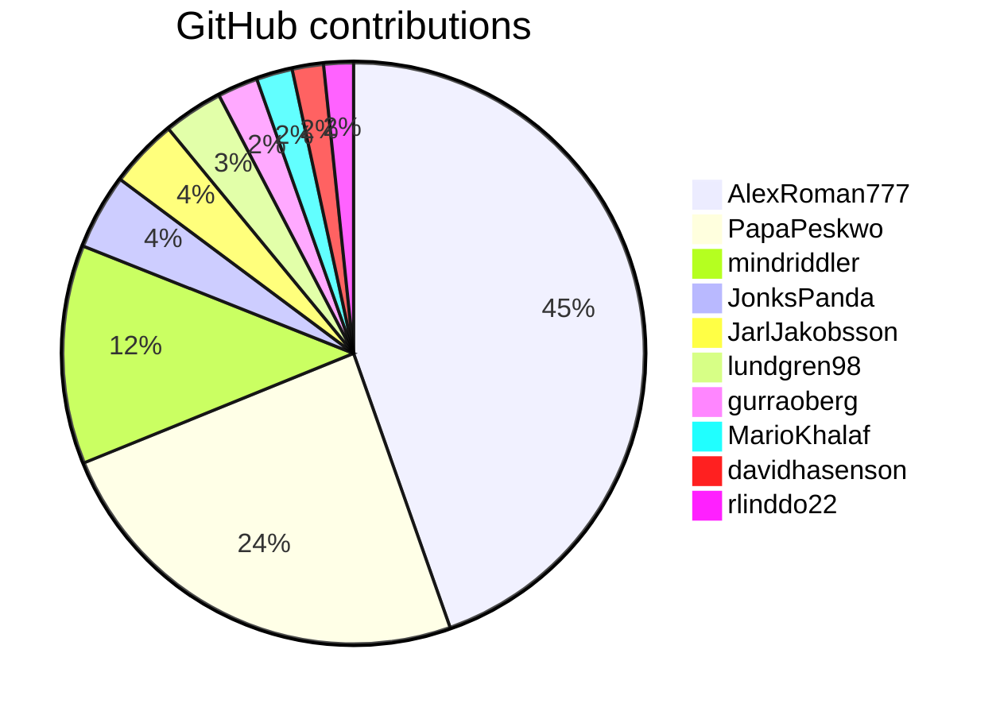

# DevOps 22 - GitHub contributions

Date and time: 1681522677.587862

| User | Contributions |
| --- | :---: |
| AlexRoman777 | 2514 |
| PapaPeskwo | 1366 |
| mindriddler | 685 |
| JonksPanda | 236 |
| JarlJakobsson | 216 |
| lundgren98 | 187 |
| gurraoberg | 127 |
| MarioKhalaf | 113 |
| davidhasenson | 98 |
| rlinddo22 | 93 |
| Corn1344 | 78 |
| JustOwl | 61 |
| Telf92 | 61 |
| Sundgren95 | 49 |
| miralee94 | 45 |
| IsabelValijani | 36 |
| AntonOttosson | 31 |
| Tolli-txt | 28 |
| DanielBrunoMatzui | 27 |
| Fradop | 25 |
| delu2201 | 22 |
| PavelKostyuk | 20 |
| IsacGrive | 16 |
| CharalamposMoutsios | 16 |
| Manibadani | 14 |
| maal2202 | 13 |
| julianbe93 | 13 |
| SamanPetfat | 10 |
| fridalundstroms | 10 |
| Skygfisk | 9 |
| raffiavakian | 8 |
| ossonack | 2 |

## Mermaid pie chart for the above table for the top 10 users

