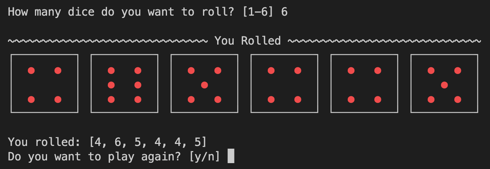

# Dice Roll

A simple script to simulate rolling a dice. Just for fun when playing board games.

---

  

---

TODO: Ask for type of game and use the standard number of dice for that game. (e.g. Yahtzee = 5 dice)
