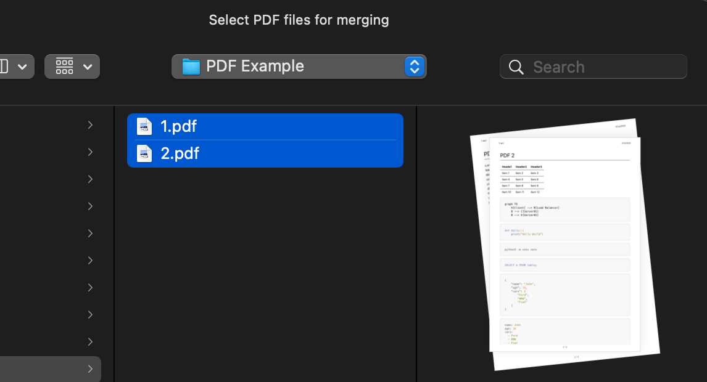
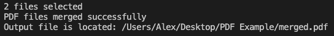

# PDF Merger

A simple script to merge multiple PDF files into one PDF file.

Recently I had to merge multiple PDF files. I found a few online websites/tools that could do this, but I wanted to do it locally on my computer. So here is a simple script that does just that.

It uses the [PyPDF](https://pypdf.readthedocs.io/en/stable/index.html#) library to merge the PDF files. The library can do a lot more than just merging PDF files, but for my use case, I just needed to merge PDF files.

---

## How it looks

Select the PDF files you want to merge.



---

Resulting PDF file.


---

Terminal output.



---

## Usage

```bash
python3 -m venv venv
```

```bash
source venv/bin/activate
```

```bash
pip install -r requirements.txt
```

```bash
python3 mergepdf.py
```

But if don't want to use the virtual environment, you can just install the PyPDF library using pip.

```bash
pip install pypdf
```

or

```bash
python3 -m pip install pypdf
```

---
