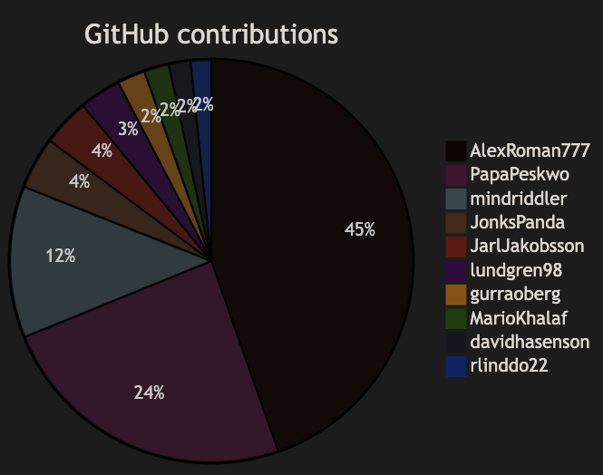

# Python Projects

A collection of Python scripts and projects.

Table of Contents:

- [Python Projects](#python-projects)
  - [PDF Merger](#pdf-merger)
  - [Dice Roll](#dice-roll)
  - [Calculator](#calculator)
  - [Data Generator](#data-generator)
  - [Smart Home](#smart-home)
  - [GitHub Contributions](#github-contributions)

---

## PDF Merger

A simple script to merge multiple PDF files into one PDF file.

Read more about it [here](/PDF-Merger/README.md).

---

## Dice Roll

A simple script to simulate rolling a dice. Just for fun when playing board games.

Read more about it [here](Fun-Projects/DiceRoll/README.md).

---

## Calculator

A simple calculator that can do basic math operations. Made while learning Tkinter.

Read more about it [here](Fun-Projects/Calculator/README.md).

---

## Data Generator

A script to generate random user data for use in testing databases, etc.

Read more about it [here](Data-Generator/README.md).

---

## Smart Home

A "fictive" smart home project. It consists of a server and multiple clients. Users can control the lights, temperature sensor and ON/OFF switch from the home panel. Uses Tkinter for the GUI and sockets for communication.

Read more about it [here](Smart-Home/README.md).

---

## GitHub Contributions

A fun project looking at the GitHub contributions of the DevOps22 students.

---

See the last list update and the Pie Chart with Top 5 [here](DevOps22/DevOps22.md).

---

Read more about it [here](DevOps22/README.md).

---

Back to [top](#python-projects)
