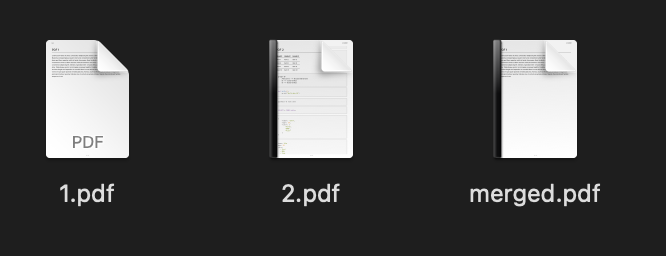
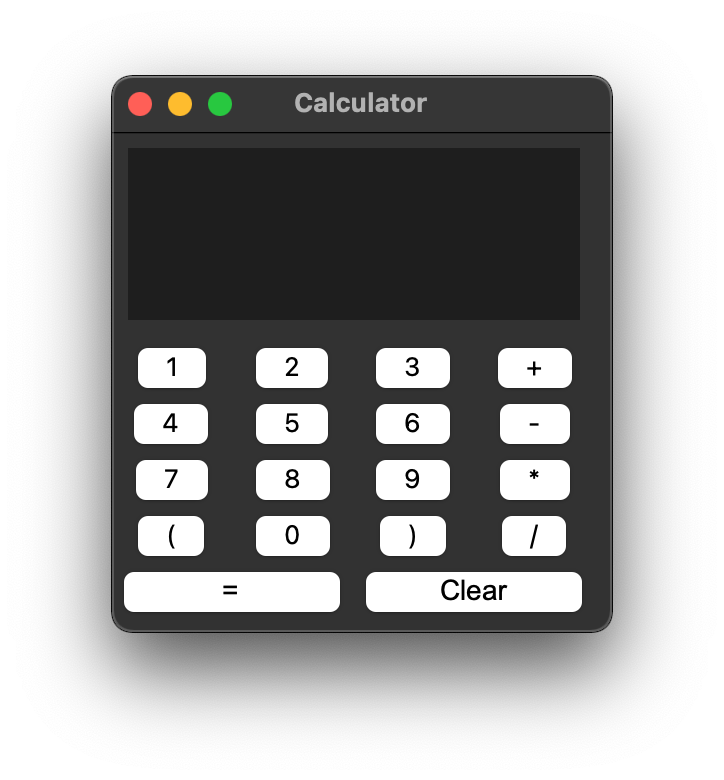
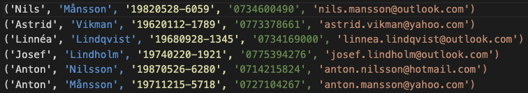
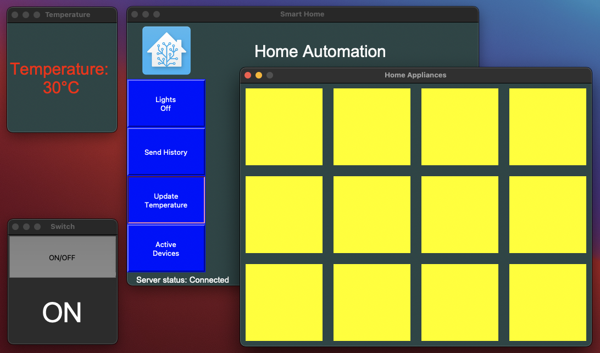
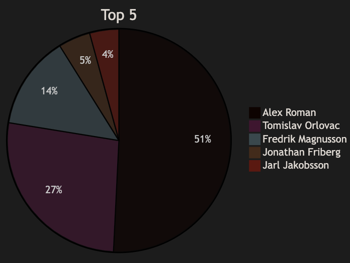
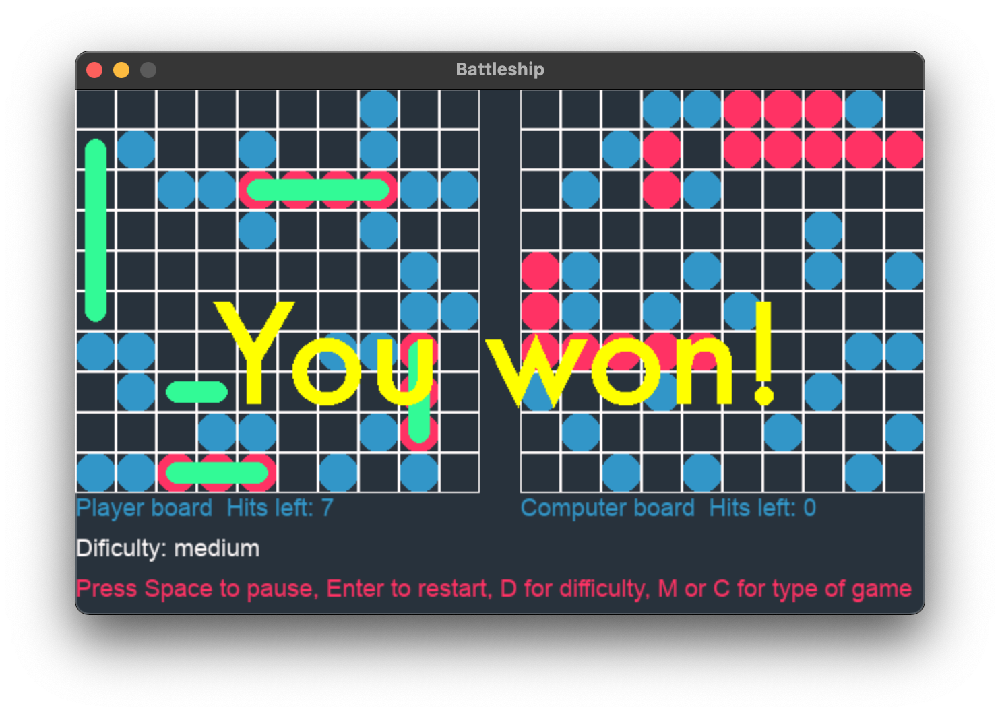
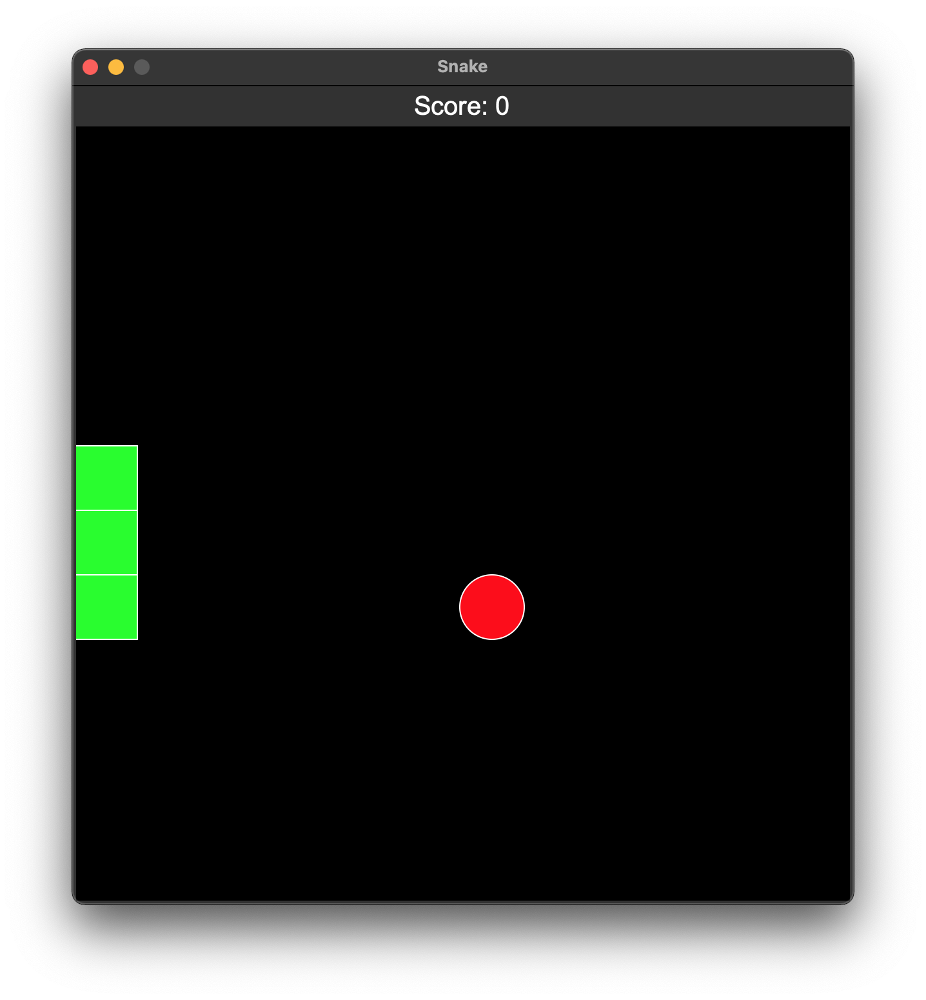

# Python Projects

A collection of Python scripts and projects.

Table of Contents:

- [Python Projects](#python-projects)
  - [PDF Merger](#pdf-merger)
  - [Dice Roll](#dice-roll)
  - [Calculator](#calculator)
  - [Data Generator](#data-generator)
  - [Smart Home](#smart-home)
  - [DevOps22 - GitHub Contributions](#devops22---github-contributions)
  - [Battleship](#battleship)
  - [Snake](#snake)
  - [More Projects](#more-projects)
  - [Python Virtual Environment](#python-virtual-environment)
    - [Step 1 - Create a virtual environment](#step-1---create-a-virtual-environment)
    - [Step 2 - Activate the virtual environment](#step-2---activate-the-virtual-environment)
    - [Step 3 - Install dependencies](#step-3---install-dependencies)

---
---

## PDF Merger

A simple script to merge multiple PDF files into one PDF file.



Read more about it [here](/PDF-Merger/README.md).

---
---

## Dice Roll

A simple script to simulate rolling a dice. Just for fun when playing board games.


Read more about it [here](Fun-Projects/DiceRoll/README.md).

---
---

## Calculator

A simple calculator that can do basic math operations. Made while learning Tkinter.



Read more about it [here](Fun-Projects/Calculator/README.md).

---
---

## Data Generator

A script to generate random user data for populating different projects, like databases, active directory, etc. Just a small tool to automate the process of creating test data.



Read more about it [here](Data-Generator/README.md).

---
---

## Smart Home

A "fictive" smart home project. It consists of a server and multiple clients. Users can control the lights, temperature sensors and ON/OFF switches from the Home Panel. Used Tkinter for the GUI and sockets for communication between the server and the clients.



Read more about it [here](Smart-Home/README.md).

---
---

## DevOps22 - GitHub Contributions

A fun project counting the GitHub contributions of the DevOps22 students. The script is run every day at 00:00 and the results are saved in a JSON file. The script also generates a Pie Chart with the Top 5 students with the most contributions. More to come... 🙂



---

See the table and the chart with Top 5 [here](GitHub-Contributions/DevOps22.md).

Read more about it [here](GitHub-Contributions/README.md).

For the last update, check this [page](https://alexroman777.github.io/DevOps22/).

---
---

## Battleship

A simple Battleship game made using Pygame. The game is played against AI. The AI is not very smart, but it is fun to play against it. The game is played on a 10x10 grid. The player and the AI have 5 ships each. The player can place the ships manually or randomly. The AI places the ships randomly. The player and the AI take turns shooting at each other's ships. The first one to sink all the opponent's ships wins.



Read more about it [here](Battleship/README.md). 

---
---

## Snake

The classic snake game, written in Python using Tkinter.



Read more about it [here](Snake/README.md).

---
---

## More Projects

[](https://git.io/typing-svg)

---
---

## Python Virtual Environment

To create a virtual environment, decide upon a directory where you want to place it, and run the venv module as a script with the directory path, in the example below, a directory named .venv

It is recommended to use a virtual environment while developing Python applications. This keeps the dependencies required by different projects in separate places by creating virtual Python environments for them. It keeps your global site-packages directory clean and manageable.

### Step 1 - Create a virtual environment

```bash
python3 -m venv .venv
```

### Step 2 - Activate the virtual environment

```bash
source .venv/bin/activate
```

### Step 3 - Install dependencies

```bash
pip install -r requirements.txt
```

---
---

Back to [top](#python-projects)
