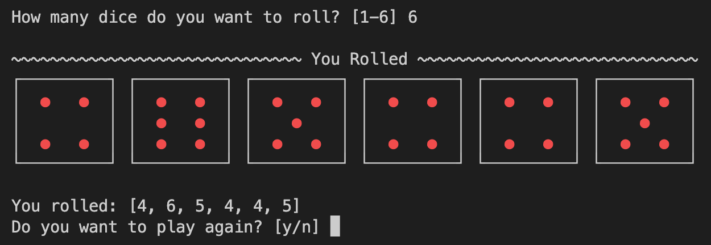

# Python Projects

A collection of Python scripts and projects.

Table of Contents:

- [Python Projects](#python-projects)
  - [PDF Merger](#pdf-merger)
  - [Dice Roll](#dice-roll)
  - [Calculator](#calculator)
  - [Data Generator](#data-generator)
  - [Smart Home](#smart-home)
  - [GitHub Contributions](#github-contributions)
  - [More Projects](#more-projects)

---

## PDF Merger

A simple script to merge multiple PDF files into one PDF file.

Read more about it [here](/PDF-Merger/README.md).

---

## Dice Roll

A simple script to simulate rolling a dice. Just for fun when playing board games.

Read more about it [here](Fun-Projects/DiceRoll/README.md).

---

## Calculator

A simple calculator that can do basic math operations. Made while learning Tkinter.

Read more about it [here](Fun-Projects/Calculator/README.md).

---

## Data Generator

A script to generate random user data for populating different projects, like databases, active directory, etc. Just a small tool to automate the process of creating test data.

Read more about it [here](Data-Generator/README.md).

---

## Smart Home

A "fictive" smart home project. It consists of a server and multiple clients. Users can control the lights, temperature sensors and ON/OFF switches from the Home Panel. Used Tkinter for the GUI and sockets for communication between the server and the clients.

Read more about it [here](Smart-Home/README.md).

---

## GitHub Contributions

A fun project counting the GitHub contributions of the DevOps22 students.

---

See the last list update and the Pie Chart with Top 5 [here](GitHub-Contributions/DevOps22.md).

---

Read more about it [here](GitHub-Contributions/README.md).

---

## More Projects

---

Back to [top](#python-projects)
