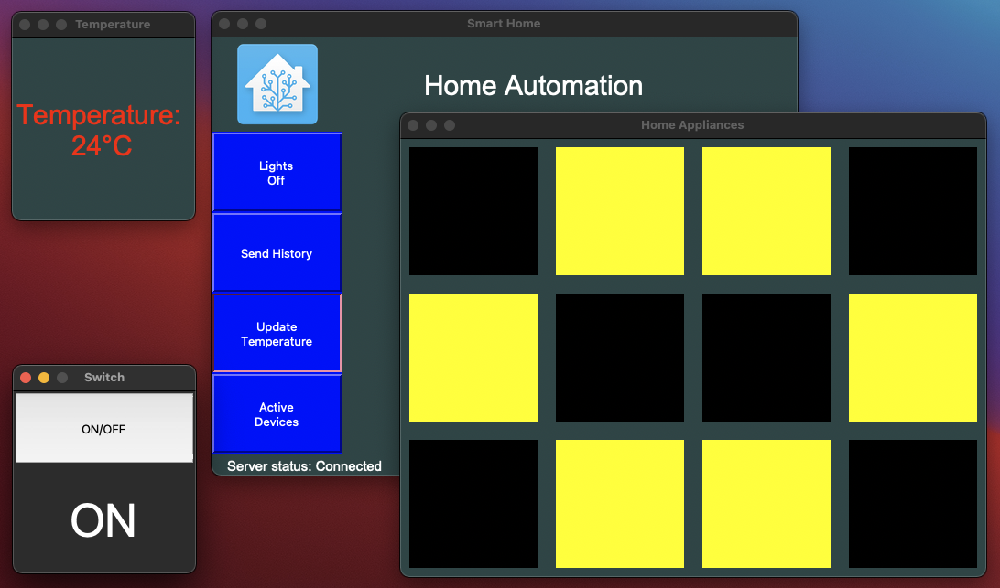
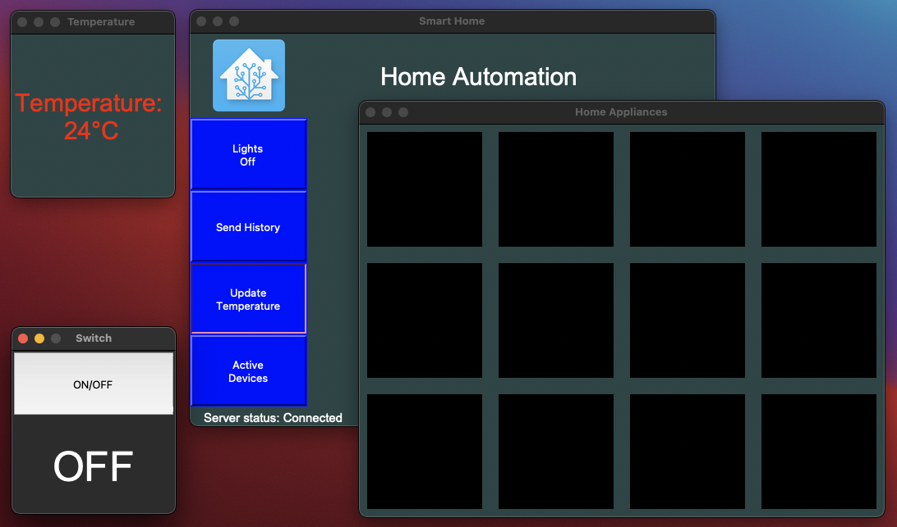
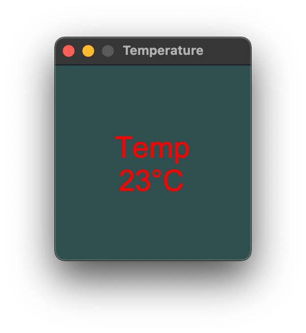
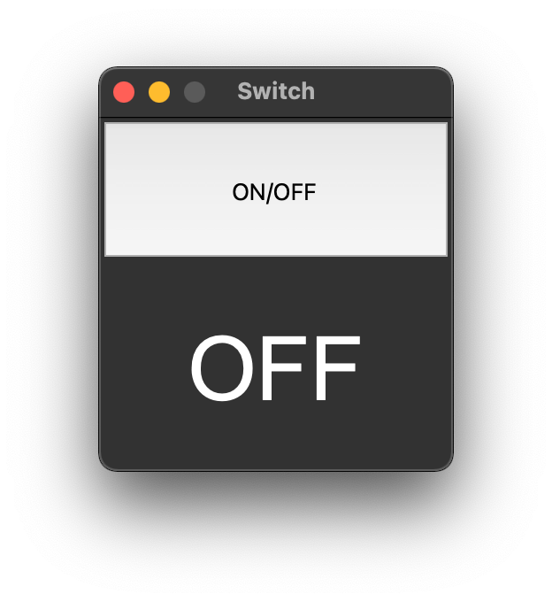
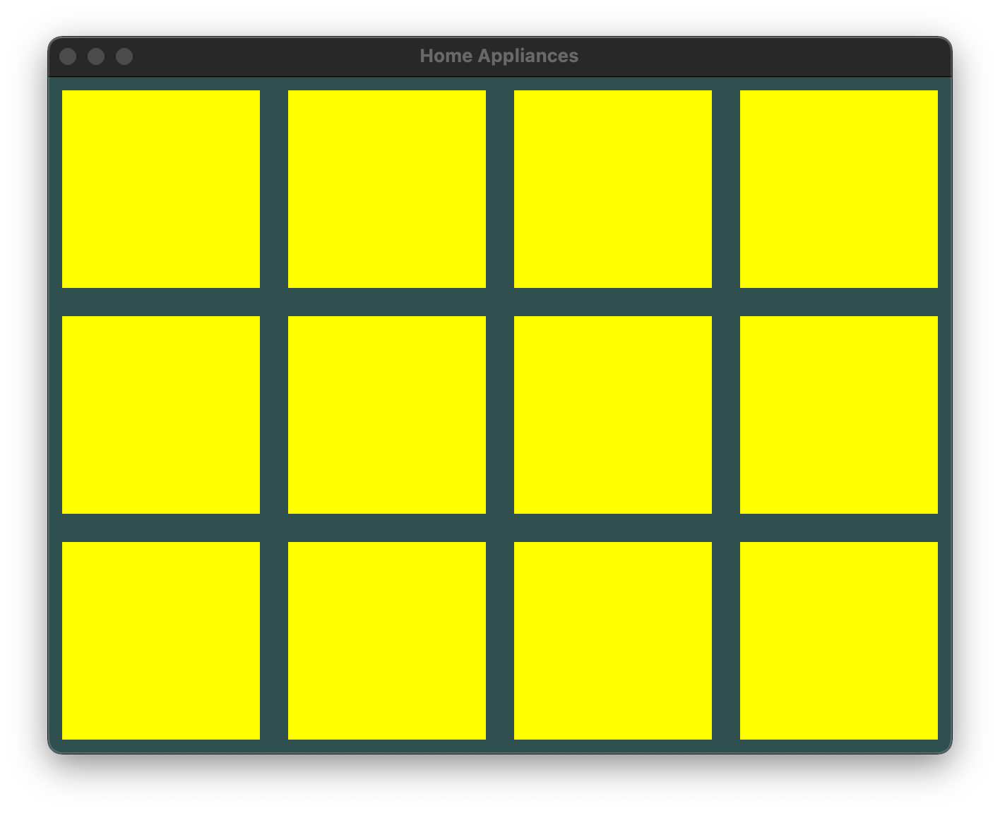
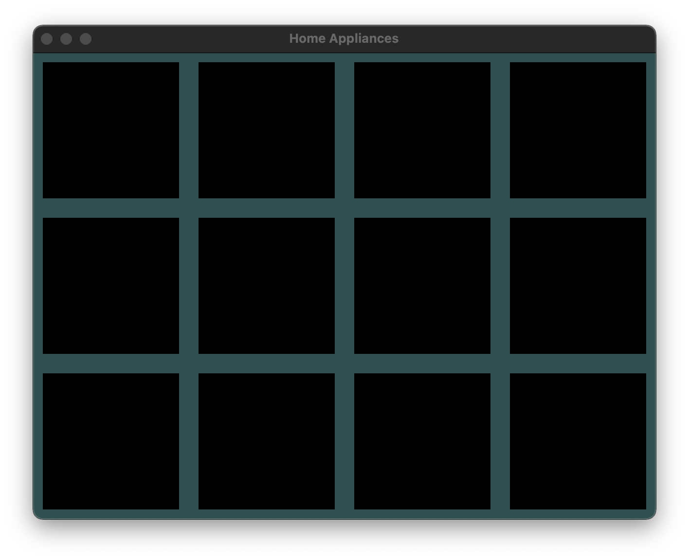

# Smart Home

Project about using sockets in Pyhonn to send commands between devices(one server and multiple clients) imitating a smart home.

The server facilitates the communication between the clients and the user. The user can send commands to the server, by typing a message or by clicking a button. The commands will be forwarded to the clients. The clients will then execute the commands and send the confirmation back to the server, which will be displayed to the user. The project was made using Python 3.11 and Tkinter and the communication between the devices was made using sockets.

---

## What i learned

- How to use sockets in Python.
- How to use Tkinter to create GUIs.
- How to use threads to run multiple processes at the same time.
- How to use Lambda functions to pass arguments to functions.
- Handling errors and exceptions, specially when using sockets.

---

## How to run

First, you need to run the server. To do so, run the following command:

```bash
python3 server.py
```

### Then, you need to run the clients

- Home panel is the main window, which will be used to send commands.

```bash
python3 home.py
```

- To run the temperature sensor, run the following command:

```bash
python3 temp.py
```

- To run the ON/OFF switch, run the following command:

```bash
python3 switch.py
```

- To run the lights, run the following command:

```bash
python3 lights.py
```

---

## How it looks

All windows are created using Tkinter. Here are some screenshots of the project in different states:

- Partially ON and OFF
- All ON
- All OFF

  

---

Temperature sensor and ON/OFF switch:

 

---

All ON and All OFF:

 

---

Back to [Python Projects](../README.md)
